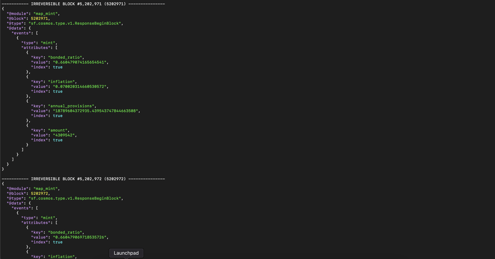

Firehose with Substreams


1.
```bash
git clone https://github.com/graphprotocol/firehose-cosmos
cd firehose-cosmos
git checkout substreams #to use substreams related flags
```

Alter the bootstrap.sh under devel/cosmoshub4 to:

```bash
#!/usr/bin/env bash

set -o errexit
set -o pipefail

CLEANUP=${CLEANUP:-"0"}
NETWORK=${NETWORK:-"mainnet"}
OS_PLATFORM=$(uname -s)
OS_ARCH=$(uname -m)
GAIA_PLATFORM=${GAIA_PLATFORM:-"linux_amd64"}

case $NETWORK in
  mainnet)
    echo "Using MAINNET"
    GAIA_VERSION=${GAIA_VERSION:-"v4.2.1"}
    GAIA_GENESIS="https://raw.githubusercontent.com/cosmos/mainnet/master/genesis/genesis.cosmoshub-4.json.gz"
    GAIA_GENESIS_HEIGHT=${GAIA_GENESIS_HEIGHT:-"5200791"}
    GAIA_ADDRESS_BOOK="https://quicksync.io/addrbook.cosmos.json"
  ;;
  testnet)
    echo "Using TESTNET"
    GAIA_VERSION=${GAIA_VERSION:-"v6.0.0"}
    GAIA_GENESIS="https://raw.githubusercontent.com/cosmos/testnets/master/v7-theta/public-testnet/genesis.json.gz"
    GAIA_GENESIS_HEIGHT=${GAIA_GENESIS_HEIGHT:-"9034670"}
  ;;
  *)
    echo "Invalid network: $NETWORK"; exit 1;
  ;;
esac

case $OS_PLATFORM-$OS_ARCH in
  Darwin-x86_64) GAIA_PLATFORM="darwin_amd64" ;;
  Darwin-arm64)  GAIA_PLATFORM="darwin_arm64" ;;
  Linux-x86_64)  GAIA_PLATFORM="linux_amd64"  ;;
  *) echo "Invalid platform"; exit 1 ;;
esac

if [[ -z $(which "wget" || true) ]]; then
  echo "ERROR: wget is not installed"
  exit 1
fi

if [[ $CLEANUP -eq "1" ]]; then
  echo "Deleting all local data"
  rm -rf ./tmp/ > /dev/null
fi

echo "Setting up working directory"
mkdir -p tmp
pushd tmp

echo "Your platform is $OS_PLATFORM/$OS_ARCH"

if [ ! -f "gaiad" ]; then
  echo "Downloading gaiad $GAIA_VERSION binary"
  wget --quiet -O ./gaiad "https://github.com/figment-networks/gaia-dm/releases/download/$GAIA_VERSION/gaiad_${GAIA_VERSION}_firehose_$GAIA_PLATFORM"
  chmod +x ./gaiad
fi

if [ ! -d "gaia_home" ]; then
  echo "Configuring home directory"
  ./gaiad --home=gaia_home init $(hostname) 2> /dev/null
  rm -f \
    gaia_home/config/genesis.json \
    gaia_home/config/addrbook.json
fi

if [ ! -f "gaia_home/config/genesis.json" ]; then
  echo "Downloading genesis file"
  wget --quiet -O gaia_home/config/genesis.json.gz $GAIA_GENESIS
  gunzip gaia_home/config/genesis.json.gz
fi

case $NETWORK in
  mainnet) # Using addrbook will ensure fast block sync time
    if [ ! -f "gaia_home/config/addrbook.json" ]; then
      echo "Downloading address book"
      wget --quiet -O gaia_home/config/addrbook.json $GAIA_ADDRESS_BOOK
    fi
  ;;
  testnet) # There's no address book for the testnet, use seeds instead
    echo "Configuring p2p seeds"
    sed -i -e 's/seeds = ""/seeds = "639d50339d7045436c756a042906b9a69970913f@seed-01.theta-testnet.polypore.xyz:26656,3e506472683ceb7ed75c1578d092c79785c27857@seed-02.theta-testnet.polypore.xyz:26656"/g' gaia_home/config/config.toml
  ;;
esac

cat << END >> gaia_home/config/config.toml

#######################################################
###       Extractor Configuration Options     ###
#######################################################
[extractor]
enabled = true
output_file = "stdout"
END

if [ ! -f "firehose.yml" ]; then
  cat << END >> firehose.yml
start:
  args:
    - ingestor
    - merger
    - firehose
  flags:
    common-first-streamable-block: $GAIA_GENESIS_HEIGHT
    common-blockstream-addr: localhost:9000
    ingestor-mode: node
    ingestor-node-path: ./gaiad
    ingestor-node-args: start --x-crisis-skip-assert-invariants --home=./gaia_home
    ingestor-node-logs-filter: "module=(p2p|pex|consensus|x/bank)"
    firehose-real-time-tolerance: 99999h
    relayer-max-source-latency: 99999h
    verbose: 1
END
fi
```

Start the firehose with:

```bash
./start.sh
```

3.

Install the Substreams CLI from: https://substreams.streamingfast.io/getting-started/installing-the-cli

I used 
```bash
brew install streamingfast/tap/substreams
```
Validate installation:
```bash
substreams --version
```

You will need a API key. You can get it from: https://app.streamingfast.io

Then, export your keys:

```bash
export STREAMINGFAST_KEY=server_123123 # Use your own API key
export SUBSTREAMS_API_TOKEN=$(curl https://auth.streamingfast.io/v1/auth/issue -s --data-binary '{"api_key":"'$STREAMINGFAST_KEY'"}' | jq -r .token)
```

Now, we can write an example substream:

We will need parts:

The substreams manifest (substreams.yaml file)

```bash
specVersion: v0.1.0
description: 

package:
  name: Mint
  version: v0.0.1

protobuf:
  files:
    - gogoproto/gogo.proto
    - types.proto
    - cosmos.proto
  importPaths:
    - ./proto

binaries:
  default:
    type: wasm/rust-v1
    file: ./target/wasm32-unknown-unknown/release/substreams.wasm

modules:
  - name: map_mint
    kind: map
    startBlock: 1
    inputs:
      - source: sf.cosmos.type.v1.Block
    output: 
      type: proto:sf.cosmos.type.v1.ResponseBeginBlock
```


Rust Manifest file (Cargo.toml)

```bash
[package]
name = "substreams"
version = "0.1.0"
description = ""
edition = "2021"
repository = "https://github.com/streamingfast/substreams-template"

[lib]
crate-type = ["cdylib"]

[dependencies]
wasm-bindgen = "0.2.79"
prost = { version = "0.11" }
prost-types = "0.11"
substreams = "0.5.6" 

[build-dependencies]
prost-build = "0.11"

[profile.release]
lto = true
opt-level = 's'
strip = "debuginfo"
```

Note that we use prost crate for protobuf encoding and decoding, and substreams crate’s version should be 0.5.6 (for map handlers and other things doesn’t work in lower versions)

Protobufs are under the proto folder.

And to generate Rust codes from protobufs:

```bash
substreams protogen ./substreams.yaml --exclude-paths="sf/substreams,google"
```

The generated Rust codes will be under src/pb folder. And also, the protobufs generate model must be referenced by a Rust module, to do so, create a file named mod.rs within the src/pb directory with the following content:

Now, the substreams module handler will be under src folder:

```bash
mod pb;

#[substreams::handlers::map]
fn map_mint(blk: pb::cosmos::Block) -> Result<pb::cosmos::ResponseBeginBlock, substreams::errors::Error> {
    let events: Vec<pb::cosmos::Event> = blk.result_begin_block
        .unwrap()
        .events
        .into_iter()
        .filter(|event| event.event_type == "mint")
        .collect();
    Ok(pb::cosmos::ResponseBeginBlock {events})
}
```

We use the source as sf.cosmos.type.v1.Block which we referenced as cosmos::Block with mod.rs, and the output is the sf.cosmos.ResponseBeginBlock as we specified in the substreams manifest.

Now, compile the substreams module with:

```bash
cargo build --release --target wasm32-unknown-unknown
```

And, one can run the substreams module (firehose should also be running) with the command:

```bash
substreams run -p -e 127.0.0.1:9030 substreams.yaml map_mint
```

**Congratulations ! 🎉**  


